**Deploy Umami on Centos 7 server using Docker compose**

*We will deploy the Umami open-source application on a CentOS 7 virtual machine using Docker Compose in a production environment. To secure the connection, we will deploy it behind a Nginx reverse proxy and install an SSL certificate using Certbot. To restrict access to the application, we will configure it to allow only traffic from whitelisted IP addresses. To protect the database, we will set up a backup mechanism that use NFS mount point to store the backup.*

*Additionally, we will monitor the Umami application using cAdvisor and Prometheus server, which should already be set up in our environment. This will help us keep track of metrics such as CPU usage, memory usage, and uptime for the Umami container and its dependencies. This way, we can quickly identify and resolve any issues that may arise*

**Prerequisite**

-   Access to the server with root privilege.

Because we will monitor one website, we are using centos 7 on VM with the following specs:

-   CPU: 2 vCPU
-   RAM: 4 GB
-   Storage: 10 GB
-   NFS Storage for backup mounted under /backup: 60 GB

**Installation:**

-   Install Docker on the server:

    *Update the packages:*

`sudo yum update`

*install the dependency:*

`sudo yum install -y yum-utils device-mapper-persistent-data lvm2`

*Add Docker repository to yum:*

`sudo yum-config-manager --add-repo https://download.docker.com/linux/centos/docker-ce.repo`

*Install Docker:*

`sudo yum install -y docker-ce`

*Enable and Start Docker:*

`systemctl enable --now docker`

*check the service is running and healthy:*

`systemctl status docker`

-   install docker compose:

*Download the latest version of Docker Compose:*

`sudo curl -L "https://github.com/docker/compose/releases/latest/download/docker-compose-\$(uname -s)-\$(uname -m)" -o /usr/local/bin/docker-compose`

*Make the Docker Compose binary executable:*

`sudo chmod +x /usr/local/bin/docker-compose`

*Verify the installation:*

`docker-compose --version`

>   We can use Ansible to initialize the server, install Docker and Docker Compose. To do this, we can create a playbook under 'ansible/initialize-server.yaml'

>   First, we need to establish a passwordless connection between the Ansible server and the mentioned server

>   To generate a new SSH key pair on the Ansible server, run the following command:

>   `ssh-keygen -t ed25519`

>   You can simply press enter for all the prompts, which will accept the default options. This will generate a new ed25519 SSH key pair in the \~/.ssh/ directory of the \> current user.

>   Next, copy the public key to the other server using the following command, replacing and with the appropriate values:

>   `ssh-copy-id -i ~/.ssh/id_ed25519.pub <username>@<server>`

>   You will be prompted for the password of the remote user account. Enter it and the public key will be added to the authorized_keys file on the remote server.

>   Test the connection by attempting to SSH into the remote server without a password:

>   `ssh <username>@<server>`

>   now we can modify the user and path of ssh key on ansible.cfg file and add the ip on the server on invitory file

>   finally run the following command:

>   `ansible-playbook ansible/initialize-server.yaml`

**Deploying:**

Deploy the service using docker compose file, we change the listing port to be 8080:

`docker-compose -f ansible/umami-docker-compose.yaml up -d`

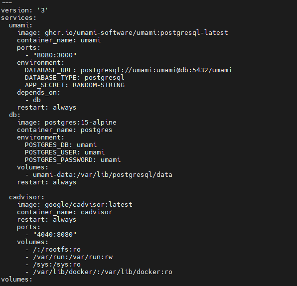

this will create two containers: one for the PostgreSQL database, with default credentials, and the second container is the official Umami container with the latest updates.

*Open the port 8080 on firewalld:*

`firewall-cmd --add-port=8080/tcp --permanent`

*Reload the firewall to apply the changes by running the following command:*

`firewall-cmd –reload`

*Verify that port 8080 is now open by running the following command:*

`firewall-cmd --list-all | grep 8080`

>   *Note*:

>   To deploy the Docker Compose file, run the following Ansible playbook:

>   `ansible-playbook ansible/deploy-umami.yaml`

>   Make sure that the `umami-docker-compose.yaml` file is located in the same path as the playbook..

>   we can test the application now by type is the browser:

<http://Ip-of-the-server:8080>

The default credentials are username: 'admin' and password: 'umami'

>   Change the credential immediately after first login.

to add website, go to sitting and press add website:

Then press edit and go to tracking code

place the following code in the \<head\>...\</head\> section of your HTML

**securer and restrict the connection:**

>   After mapping the IP address to a specific domain or subdomain, we need to install an SSL certificate to secure the communication.

*install nginx as reverse proxy:*

`sudo yum install nginx`

*enable and start nginx service*

`systemctl enable –now nginx`

*verify the service is running and healthy:*

`systemctl status nginx`

*Open the Nginx configuration file:*

`sudo vi /etc/nginx/conf.d/umami.conf`

*Add the following:*

If we have a list of whitelisted IP addresses that should have access to the server, it is recommended to restrict access by adding the following configuration to Nginx:

*Test the Nginx configuration:*

`sudo nginx -t`

*If the configuration is valid, restart Nginx:*

`sudo systemctl restart nginx`

Open the port 80 on firewalld:

`firewall-cmd --add-port=80/tcp --permanent`

*Reload the firewall to apply the changes by running the following command:*

`firewall-cmd --reload`

Now, when you visit "http://umami.kalvad.com" in a web browser, Nginx will forward the connection to the container running on port 8080.

To add an SSL certificate to your Nginx configuration using Certbot, follow these steps:

Install Certbot by running the following command:

`sudo yum install certbot python2-certbot-nginx`

Make sure that your domain name is pointing to the correct IP address.

Run Certbot to obtain a certificate for your domain name by running the following command:

`sudo certbot --nginx -d umami.kalvad.com`

Certbot will ask you some questions about your email address and whether you agree to the terms of service. Once you have answered these questions, Certbot will automatically configure Nginx to use HTTPS.

Test your configuration by visiting https://umami.kalvad.com in your web browser. You should see a green padlock icon indicating that your website is secure.

>   Note: If you see any errors, make sure that your firewall is allowing traffic on port 443, and check the Certbot logs for any error messages.

Open the port 8080 on firewalld:

`firewall-cmd --add-port=443/tcp --permanent`

Reload the firewall to apply the changes by running the following command:

`firewall-cmd --reload`

**backup the database:**

To backup the database, we need to copy the volume of 'umami-data' to the NFS mountpoint '/backup' and create a cronjob to run this task every 6 hours. Here are the steps to follow:

copy the backup.sh script to the server under /etc/script or any path

make suer that the file has executable permission

`chmod +x /path/to/backup.sh`

To run this script every 6 hours, you can use a cron job. Open the crontab file with crontab -e and add the following line to run the script every 6 hours:

`0 \*/6 \* \* \* /path/to/backup.sh`

**Monitoring the containers:**

To monitor the containers in the umami deployment, we will deploy cAdvisor using Docker Compose. cAdvisor will be responsible for exporting the metrics of the PostgresDB and Umami containers to the Prometheus server. Prometheus will monitor the container metrics and create alerting rules based on the data provided by cAdvisor.

To begin, we need to add the cAdvisor service to our umami-docker-compose.yaml file. This can be done by creating a new service block under the services section and specifying the image as “google/cadvisor”. We can also define the necessary ports to expose cAdvisor's web interface and the container metrics to Prometheus.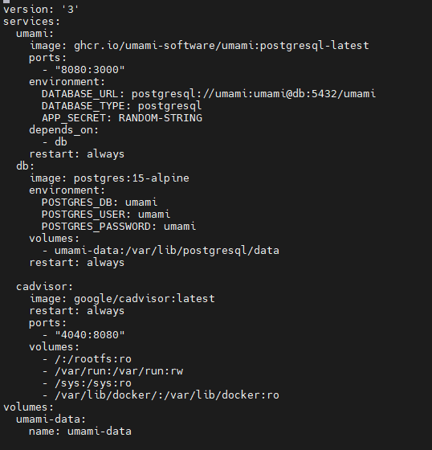

Run the following to update the stack:

Docker-compose -f umami-docker-compose.yaml up -d

Here we are mapping port 4040 on the host with port 8080 on cAdviso container.

we can access its web UI by navigating to http://ip-of-vm:4040 in a web browser. If the port is not accessible, you may need to open it in the firewalld. Once the web UI is accessible, we can monitor the container metrics and ensure that cAdvisor is working correctly.

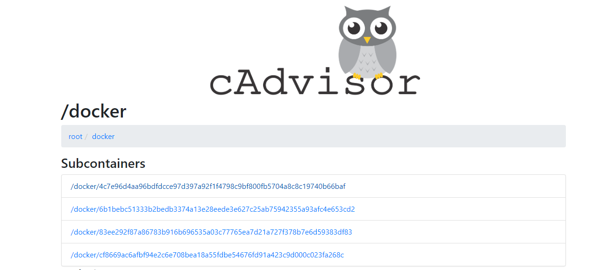

Next, we need to establish a connection between the Prometheus server and this server on port 4040. Then, we can add a new job to extract the metrics from cAdvisor and monitor the containers. This can be done by adding the appropriate configuration to the Prometheus server's configuration file under /etc/prometheus/prometheus.yml.

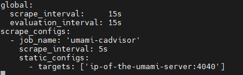

Finally, check if the target is up and running on the Prometheus UI by navigating to Status -\> Targets.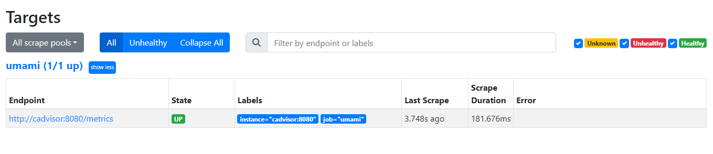

After defining the alerting rules in the prometheus-alert-rules.yaml file, we need to include it in Prometheus configuration. To do this, we add the rule_files section to prometheus.yml file and specify the path to the rules file. Then, we restart the Prometheus service to apply the changes. Finally, we can verify that the rules were added successfully by checking the Alert tab on the Prometheus web interface..

The rules in prometheus-alert-rules.yaml file:

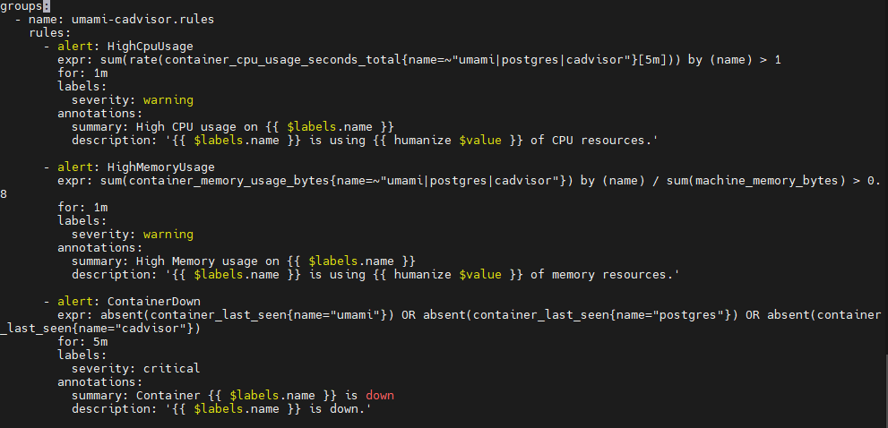

And we can link It to Prometheus configuration file as the following:

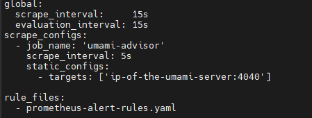

We can check that the rules added on Alert Tab.

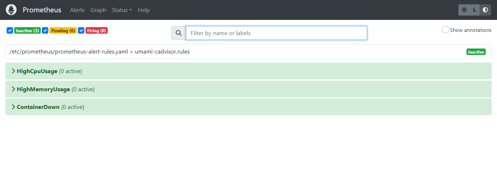

*When deploying Umami using Docker Compose, there are certain drawbacks that may not be acceptable in certain environments. These drawbacks include the lack of scalability and high availability, which could result in downtime. Additionally, there is a security concern since credentials are written in plain text in the Docker Compose file.*

*If these drawbacks are considered critical to the environment, an alternative approach is to deploy Umami in a Kubernetes environment. This approach provides greater scalability and high availability, as well as better security measures for credentials management.*

**Deploying umami in Kubernetes.**

*We will assume that a Kubernetes cluster has been established and is operational. Our next step is to install all the necessary resources within the Umami namespace. We will create certificates using cert-manager and create an ingress to receive and forward connections to the Umami service. Assuming that we have already installed an Nginx ingress controller, we will create the following resources:*

-   *Namespaces to contain all the resources*
-   *Secrets that will contain the credentials*
-   *Two services to connect to Umami and the Postgres database*
-   *Persistent Volume (PV) and Persistent Volume Claim (PVC) to store the PostgresDB data*
-   *StatefulSet for the databases*
-   *Deployment for the Umami application*

To create the namespaces 'umami' that will contain all the resources we will create, follow these steps:

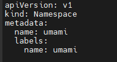

>   Note: all the yaml files in the kubernetes directory.

`kubectl apply -f umami-namespace.yaml`

After creating the namespaces, we need to create a secret that contains the database type, password, URL, and a random string for authentication security. Follow these steps:

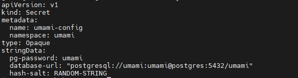

`kubectl apply -f umami-secret.yaml`

We will create two services with type 'ClusterIP': one for PostgreSQL and one for Umami. Follow these steps:

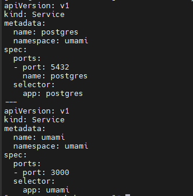

`kubectl apply -f umami-svc.yaml`

To ensure redundancy and availability, we will create a persistent volume and persistent volume claim to attach to the PostgreSQL database. Please note that we have deployed it using a hostpath which is not recommended for production environments. Instead, consider using NFS or a storage class on your Kubernetes host, particularly if you are using a cloud provider

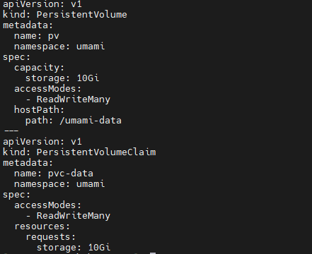

`kubectl -f apply umami-storage.yaml`

We will now deploy a StatefulSet for the PostgreSQL database with 2 replicas. Follow these steps:

`kubectl apply -f pg.yaml`

To complete the setup, we will deploy Umami as a deployment with 2 replicas. Follow these steps:

`kubectl apply -f umami-app.yaml`

After completing all the steps, ensure that all the resources under the 'umami' namespace are running by running the following command:

`kubectl get deployment, statefulset, service, persistentvolume, persistentvolumeclaim -n umami`

This will provide you with an overview of all the resources that have been created under the 'umami' namespace."

After completing all the previous steps, the next step is to create an ingress rule to enable external access to the Umami application. First, we need to create the required SSL certificate using cert-manager. Follow these steps:

-   Install cert-manager on your Kubernetes cluster.
-   Create an issuer that defines the certificate authority to use for generating the SSL certificate.
-   Create a certificate that references the issuer and the domain name for which the SSL certificate should be generated. Once the SSL certificate has been generated, we can proceed with creating the ingress rule that will route traffic to the Umami application. Here are the steps to follow:
-   Create an ingress resource that defines the routing rules for incoming traffic.
-   Verify that the ingress rule has been created successfully and that the Umami application can be accessed using the specified domain name.

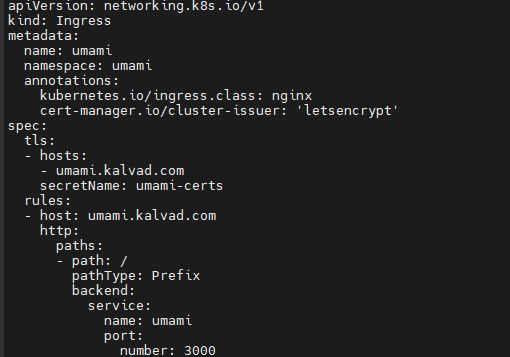

`kubectl apply -f umami-ingress.yaml`
