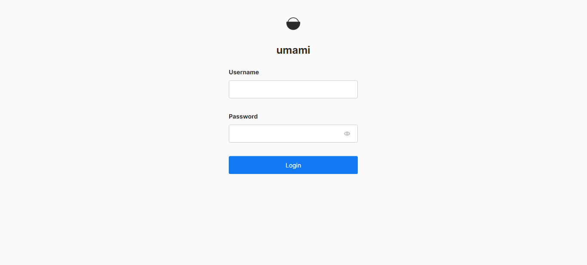

**Deploy Umami on Centos 7 server using Docker compose**

**Prerequisite**

-   Access to the server with root privilege.
   Because we will monitor one website, we using centos 7 on VM with the following specs:
-   CPU: 2 vCPU
-   RAM: 4 GB
-   Storage: 10 GB
-   NFS Storage for backup mounted under /backup: 60 GB

**Installation:**

-   Install Docker on the server:

    *Update the packages:*

`sudo yum update`

*install the dependency:*

`sudo yum install -y yum-utils device-mapper-persistent-data lvm2`

*Add Docker repository to yum:*

`sudo yum-config-manager --add-repo https://download.docker.com/linux/centos/docker-ce.repo`

*Install Docker:*

`sudo yum install -y docker-ce`

*Enable and Start Docker:*

`systemctl enable --now docker`

*check the service is running and healthy:*

`systemctl status docker`

-   install docker compose:

*Download the latest version of Docker Compose:*

`sudo curl -L "https://github.com/docker/compose/releases/latest/download/docker-compose-\$(uname -s)-\$(uname -m)" -o /usr/local/bin/docker-compose`

*Make the Docker Compose binary executable:*

`sudo chmod +x /usr/local/bin/docker-compose`

*Verify the installation:*

`docker-compose --version`

> We can initialize the server and install docker and docker compose use ansible, we create playbook to do that under ansible/ initialize-server.yaml

> First we establish password less between the ansible server and mention server

> generate a new SSH key pair on the Ansible server by running the following command:

> `ssh-keygen -t ed25519`

> You can press enter for all of the prompts to accept the default options. This will generate a new ed25519 SSH key pair in the \~/.ssh/ directory of the current user.

> Next, copy the public key to the other server using the following command, replacing \<username\> and \<server\> with the appropriate values:

> `ssh-copy-id -i \~/.ssh/id_ed25519.pub \<username\>@\<server\>`

> You will be prompted for the password of the remote user account. Enter it and the public key will be added to the authorized_keys file on the remote server.

> Test the connection by attempting to SSH into the remote server without a password:

> `ssh \<username\>@\<server\>`

> now we can modify the user and path of ssh key on ansible.cfg file and add the ip on the server on invitory file

> finally run the following command:

> `ansible-playbook ansible/initialize-server.yaml`

**Deploying:**

Deploy the service using docker compose file, we change the listing port to be 8080:

docker-compose -f ansible/umami-docker-compose.yaml up -d

this will create two containers: one for the PostgreSQL database, with default credentials, and the second container is the official Umami container with the latest updates.

*Open the port 8080 on firewalld:*

firewall-cmd --add-port=8080/tcp –permanent

*Reload the firewall to apply the changes by running the following command:*

firewall-cmd –reload

*Verify that port 8080 is now open by running the following command:*

firewall-cmd --list-all \| grep 8080

*Note*:

we can deploy the docker compose file be run the following ansible playbook:

ansible-playbook ansible/deploy-umami.yaml

and make sure that the umami-docker-compose.yaml on the same path as playbook.

we can test the application now by type is the browser:

<http://Ip-of-the-server:8080>

The default credential is username: admin and password: umami

Change the credential immediately after first login.

to add website, go to sitting and press add website:

Then press edit and go to tracking code

place the following code in the \<head\>...\</head\> section of your HTML

**securer and restrict the connection:**

we need to be mapping the ip address to specific domain or sub domain,

after that we can install SSL certificate to secure the communication:

*install nginx as reverse proxy:*

sudo yum install nginx

*enable and start nginx service*

systemctl enable –now nginx

*verify the service is running and healthy:*

systemctl status nginx

*Open the Nginx configuration file:*

sudo vi /etc/nginx/conf.d/umami.conf

*Add the following:*

server {

listen 80;

server_name umami.kalvad.com;

location / {

proxy_pass http://localhost:8080;

proxy_set_header Host \$host;

proxy_set_header X-Real-IP \$remote_addr;

proxy_set_header X-Forwarded-For \$proxy_add_x_forwarded_for;

}

}

If we have a list of whitelisted IP addresses that we know should only have access to the server, it is recommended to restrict access by adding the following configuration to Nginx.

server {

listen 80;

server_name umami.kalvad.com;

location / {

proxy_pass http://localhost:8080;

proxy_set_header Host \$host;

proxy_set_header X-Real-IP \$remote_addr;

proxy_set_header X-Forwarded-For \$proxy_add_x_forwarded_for;

allow 192.0.2.1; \# replace with the whitelist IP

deny all;

}

}

*Test the Nginx configuration:*

sudo nginx -t

*If the configuration is valid, restart Nginx:*

sudo systemctl restart nginx

Open the port 80 on firewalld:

firewall-cmd --add-port=80/tcp –permanent

*Reload the firewall to apply the changes by running the following command:*

firewall-cmd –reload

Now, when you visit "http://umami.kalvad.com" in a web browser, Nginx will forward the connection to the container running on port 8080.

add an SSL certificate to your Nginx configuration using Certbot, follow these steps:

Install Certbot by running the following command:

sudo yum install certbot python2-certbot-nginx

Make sure that your domain name is pointing to the correct IP address.

Run Certbot to obtain a certificate for your domain name by running the following command:

sudo certbot --nginx -d umami.kalvad.com

Certbot will ask you some questions about your email address and whether you agree to the terms of service. Once you have answered these questions, Certbot will automatically configure Nginx to use HTTPS.

Test your configuration by visiting https://umami.kalvad.com in your web browser. You should see a green padlock icon indicating that your website is secure.

Note: If you see any errors, make sure that your firewall is allowing traffic on port 443, and check the Certbot logs for any error messages.

Open the port 8080 on firewalld:

firewall-cmd --add-port=443/tcp –permanent

Reload the firewall to apply the changes by running the following command:

firewall-cmd –reload

backup the database:

to copy the database data, we need to copy the volume of umami-data volume to the NFS mountpoint /backup and create cronjob to do this every 6 hours So we do the following:

copy the backup.sh script to the server under /etc/script or any path

make suer that the file has executable permission

chmod +x /path/to/backup.sh

To run this script every 6 hours, you can use a cron job. Open the crontab file with crontab -e and add the following line to run the script every 6 hours:

0 \*/6 \* \* \* /path/to/backup.sh

When deploying Umami using Docker Compose, there are certain drawbacks that may not be acceptable in certain environments. These drawbacks include the lack of scalability and high availability, which could result in downtime. Additionally, there is a security concern since credentials are written in plain text in the Docker Compose file.

If these drawbacks are considered critical to the environment, an alternative approach is to deploy Umami in a Kubernetes environment. This approach provides greater scalability and high availability, as well as better security measures for credentials management.

**Deploying umami in Kubernetes.**

First we need to create namespaces umami that will contain all the resources that we will create:

Kubectl apply -f umami-namespace.yaml

Then we need to create secret that contains the database type, password and URL along with random string for auth security.

Kubectl apply -f umami-secret.yaml

We will create two service with type cluster IP one for postgresDB and one for umami:

Kubectl apply -f umami-svc.yaml

We will now create a persistent volume and persistent volume claim to attach to the Postgres database for redundancy and availability. However, please note that we have deployed it using a hostpath which is not recommended for production environments. Instead, you should consider using NFS or a storage class on your Kubernetes host, especially if you are using a cloud provider.

Kubectl -f apply umami-storage.yaml

Now we will deploy statefulset for postgres database with 2 replicas:

Kubectl apply -f pg.yaml

Finally, we deploy umami as deployment with 2 replicas:

Kubectl apply -f umami-app.yaml

Make sure that all resources under umami namespace are running

kubectl get deployment,statefulset,svc,pv,pvc -n umami

now we will create ingress rule after we create the required SSL cert using cert-manager:

Kubectl apply -f umami-ingress.yaml
